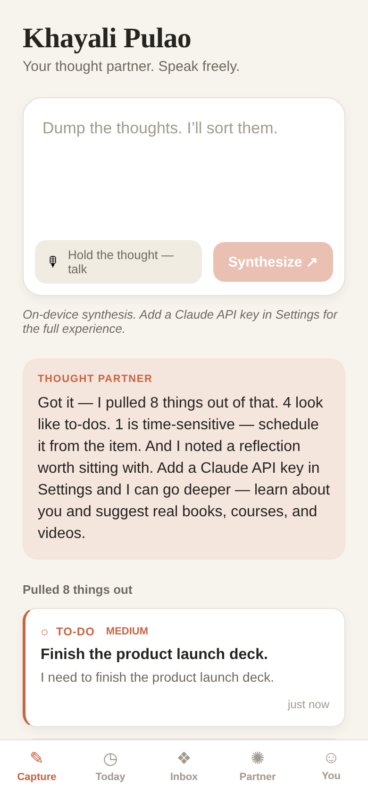
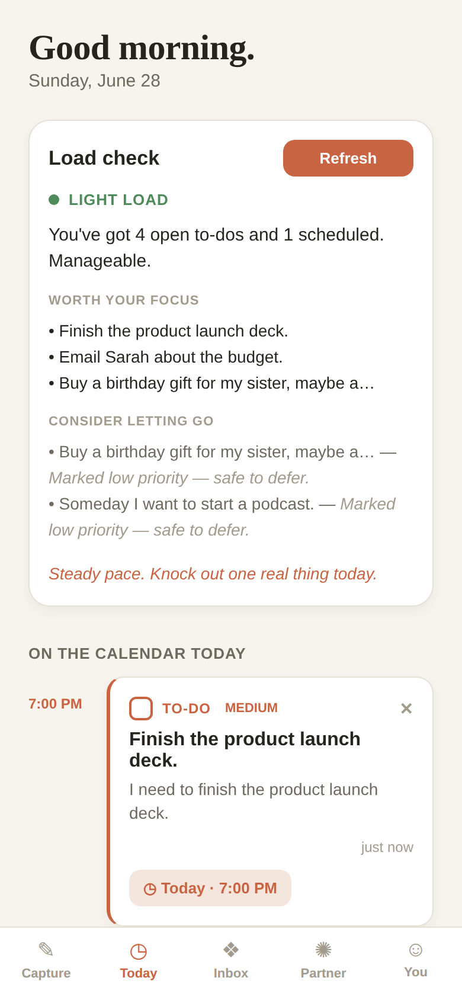
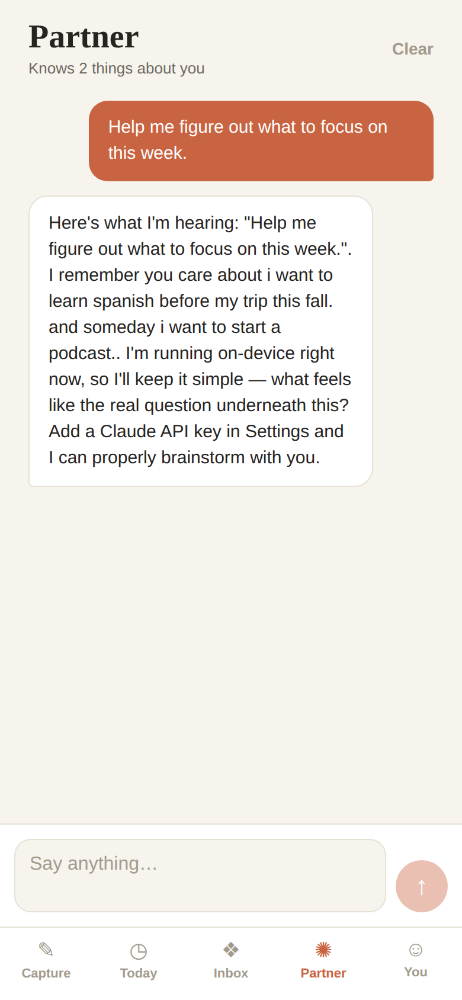
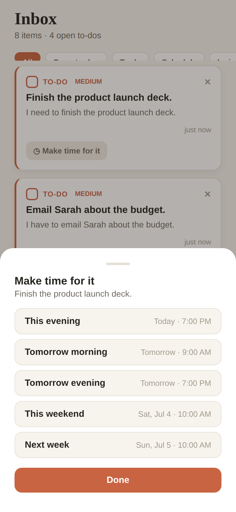

# Khayali Pulao 🍚💭

A voice-first thought partner. Speak (or type) freely — books you want to read,
skills to learn, messages to send, work to do, things you're feeling — and the
app synthesizes that raw stream into structured items, **learns who you are over
time**, suggests where to go next, helps you **make time** for what matters, and
**keeps you honest** when you're taking on too much.

Built with Expo / React Native + TypeScript, powered by Claude with a fully
offline fallback so nothing ever hard-fails. Warm, light, editorial design.

## How it looks

| Capture | Today (load check) | Library |
| --- | --- | --- |
|  |  |  |

| Partner | Schedule | About you |
| --- | --- | --- |
|  |  |  |

_(Screenshots are the on-device fallback engine, with no API key — the Claude-backed
path produces richer titles, replies, and suggestions.)_

## What it does

### 🎙 Capture — speak freely, get it sorted
One calm input. Talk (Web Speech API in the browser build) or type a stream of
thoughts. Each capture is broken into atomic items, each routed to a type:
- **To-do** — a concrete action, with a priority.
- **Schedule** — something time-sensitive worth making time for.
- **Insight** — a reflection, feeling, value, or pattern about you.
- **Note** — anything else worth keeping.

You also get a warm **thought-partner reply** reacting to what actually mattered.

### ☺ You — it gets to know you
Every capture quietly extracts **durable facts** — your goals, interests, values,
the people who matter, your current focus, recurring patterns — into a **profile**
that grows over time and reinforces what it hears repeatedly. The **Library**
collects every book / course / video / practice it has suggested, with working
search links; save the good ones, dismiss the rest.

### ◷ Today — make time + a load check
- An **agenda** of what you've scheduled for today and what's coming up.
- A **load check**: tap and the coach reads everything on your plate and gives a
  grounded read — what's genuinely worth your focus, what to consider letting go,
  and an honest nudge when you're **overloaded**. ("You're trying to do too much —
  let's whittle it down.")

### ✺ Partner — brainstorm with someone who knows you
A conversational thread that has your profile and recent thoughts in context.
Bring it a knotty decision or a half-formed idea and think out loud together.

### Scheduling & your calendar
Any to-do or event can be given a time with one tap (This evening, Tomorrow
morning, This weekend…). On a phone you can **add it to your device calendar**.

## The intelligence

`src/ai/` has two backends behind every feature:

- **Claude-backed** (`capture.ts`, `chat.ts`, `coach.ts` over `client.ts`) — when
  a Claude API key is set in Settings, thoughts are synthesized by Claude: it
  returns the items, the partner reply, profile updates, and suggestions in a
  single structured call; chat and the load-check have their own prompts with your
  context woven in.
- **On-device** (`local.ts`) — a dependency-free heuristic engine that keeps the
  whole app working with **no key and no network**, and is the automatic fallback
  if any API call fails.

Everything is **local-first**: thoughts, items, profile, suggestions, and chat
live only on your device (`AsyncStorage`); the API key is stored in the secure
keychain (browser storage on web). Suggestion links are always routed through a
real search surface — the model never produces live URLs we'd have to trust.

## Run it

```bash
npm install
npm run web        # best for trying voice-to-text
# or
npm start          # then scan the QR with Expo Go, or press i / a
```

Add a Claude API key under **You → Settings** to switch from on-device synthesis
to the full Claude-powered experience. Default model is `claude-sonnet-4-6`;
Opus 4.8 and Haiku 4.5 are also selectable.

> **Voice:** speech-to-text is real on both platforms — on native it uses
> **on-device** recognition (Apple Speech / Android `SpeechRecognizer`) via
> `@react-native-voice/voice`, and on web it uses the Web Speech API. Native
> recognition needs a **dev build** (`npx expo run:ios` / `run:android` or an EAS
> build) — it is **not** available in Expo Go, where the app falls back to typing.
>
> **Device calendar:** export uses `expo-calendar`, available on native builds; on
> web it degrades to the in-app agenda.

### Trying native voice

```bash
npx expo run:ios       # or: npx expo run:android  (needs Xcode / Android SDK)
```

This produces a dev build with the microphone + speech-recognition entitlements
declared in `app.json`, so the mic button does live on-device transcription.

## Project layout

```
App.tsx                      Tab shell (Capture / Today / Inbox / Partner / You)
src/
  types.ts                   Domain model
  storage.ts                 AsyncStorage persistence
  settings.ts                Secure API-key + model storage
  schedule.ts                Time-slot helpers
  calendar.ts                Optional device-calendar export (expo-calendar)
  theme.ts                   Colors, spacing, per-type styling
  store/AppContext.tsx       App state: capture, profile merge, suggestions,
                             chat, scheduling, coach review
  ai/
    client.ts                Anthropic Messages API wrapper + JSON helpers
    capture.ts               Claude capture → items + reply + profile + suggestions
    chat.ts                  Conversational partner (context-aware)
    coach.ts                 Accountability / load review
    suggestions.ts           Suggestion → real search-link mapping
    local.ts                 On-device fallbacks for all of the above
  voice/useVoiceCapture.ts   Speech-to-text: native on-device + web, graceful degrade
  components/                ItemCard, SuggestionCard, ChatBubble, ScheduleSheet
  screens/                   Capture, Today, Inbox, Partner, You, Settings
```

## Notes & next steps

- Everything stays on-device; there's no backend. A future version could sync
  across devices and run periodic accountability check-ins as notifications.
- Native voice capture and richer calendar two-way sync are the natural follow-ons.
